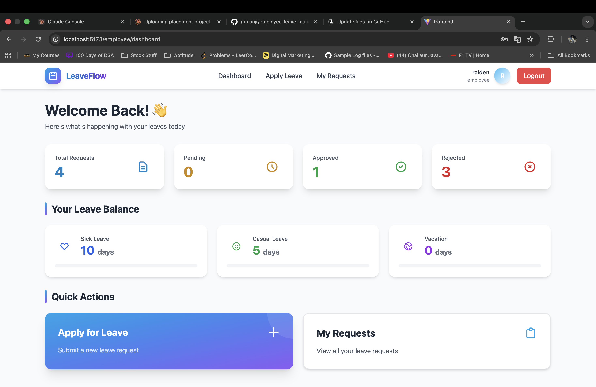
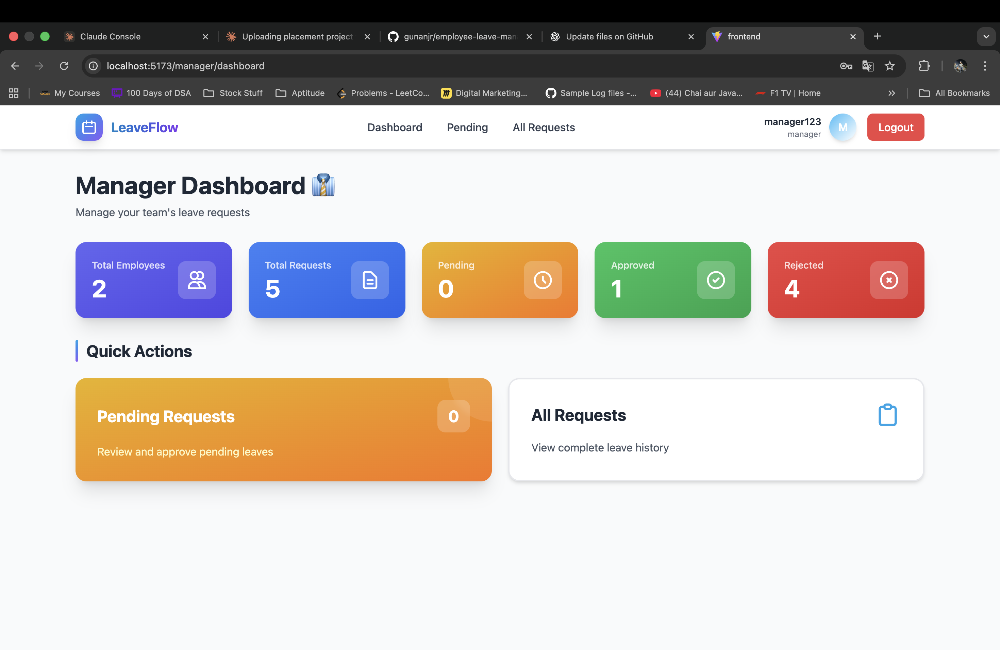

# 🏢 Employee Leave Management System

A modern, full-stack leave management system built with React, Node.js, Express, and MongoDB. This application streamlines the leave request and approval process for organizations with dedicated employee and manager portals.


## 📸 Screenshots

### Employee Dashboard


### Manager Dashboard


### Apply Leave Form


## ✨ Features

### 👨‍💼 Employee Features
- ✅ User registration and authentication
- ✅ Apply for leave (Sick, Casual, Vacation)
- ✅ View all leave requests with real-time status
- ✅ Track leave balance for each category
- ✅ Cancel pending leave requests
- ✅ Interactive dashboard with statistics
- ✅ Profile management

### 👔 Manager Features
- ✅ Secure manager authentication
- ✅ View all pending leave requests
- ✅ Approve or reject leaves with comments
- ✅ View complete leave history of all employees
- ✅ Comprehensive team statistics dashboard
- ✅ Real-time leave status updates

## 🛠️ Tech Stack

### Frontend
- **React 18** - Modern UI library
- **Redux Toolkit** - State management
- **React Router v6** - Client-side routing
- **Tailwind CSS** - Utility-first styling
- **Axios** - HTTP client
- **React Hot Toast** - Notifications
- **Vite** - Build tool

### Backend
- **Node.js** - Runtime environment
- **Express.js** - Web framework
- **MongoDB** - NoSQL database
- **Mongoose** - ODM
- **JWT** - Authentication
- **Bcrypt.js** - Password hashing
- **CORS** - Cross-origin support

## 📋 Prerequisites

Before running this project, make sure you have:

- **Node.js** (v16.0.0 or higher) - [Download](https://nodejs.org/)
- **MongoDB** (v6.0 or higher) - [Download](https://www.mongodb.com/try/download/community)
- **npm** or **yarn** package manager
- **Git** - For version control

## 🚀 Installation & Setup

### 1️⃣ Clone the Repository

```bash
git clone https://github.com/yourusername/employee-leave-management.git
cd employee-leave-management
```

### 2️⃣ Backend Setup

```bash
# Navigate to backend directory
cd backend

# Install dependencies
npm install

# Create environment file
cp .env.example .env

# Edit .env file with your configuration
# (Use nano, vim, or any text editor)
nano .env
```

**Configure your `.env` file:**
```env
PORT=5000
MONGO_URI=mongodb://localhost:27017/leave-management
JWT_SECRET=your_super_secret_jwt_key_change_this_in_production_12345
NODE_ENV=development
```

### 3️⃣ Frontend Setup

```bash
# Navigate to frontend directory (from root)
cd frontend

# Install dependencies
npm install
```

### 4️⃣ Start MongoDB

**For macOS (using Homebrew):**
```bash
# Start MongoDB service
brew services start mongodb-community@7.0

# Verify MongoDB is running
brew services list
```

**For Windows:**
```bash
# Start MongoDB as a service
net start MongoDB
```

**For Linux:**
```bash
# Start MongoDB service
sudo systemctl start mongod

# Enable MongoDB to start on boot
sudo systemctl enable mongod
```

### 5️⃣ Run the Application

**Open two terminal windows:**

**Terminal 1 - Start Backend:**
```bash
cd backend
npm run dev
```
✅ Backend server runs on: `http://localhost:5000`

**Terminal 2 - Start Frontend:**
```bash
cd frontend
npm run dev
```
✅ Frontend application runs on: `http://localhost:5173`

## 🌐 Access the Application

Once both servers are running:

1. Open your browser and navigate to: `http://localhost:5173`
2. Register a new account or use test credentials

## 👤 Test Accounts

Create these accounts to test different roles:

### Employee Account
```
Email: employee@test.com
Password: password123
Role: Employee
```

### Manager Account
```
Email: manager@test.com
Password: password123
Role: Manager
```

## 📊 Database Schema

### User Model
```javascript
{
  name: String,
  email: String (unique),
  password: String (hashed),
  role: String (employee/manager),
  leaveBalance: {
    sickLeave: Number (default: 10),
    casualLeave: Number (default: 5),
    vacation: Number (default: 5)
  },
  timestamps: true
}
```

### Leave Request Model
```javascript
{
  userId: ObjectId (ref: User),
  leaveType: String (sick/casual/vacation),
  startDate: Date,
  endDate: Date,
  totalDays: Number,
  reason: String,
  status: String (pending/approved/rejected),
  managerComment: String,
  timestamps: true
}
```

## 🔌 API Endpoints

### Authentication
| Method | Endpoint | Description | Auth Required |
|--------|----------|-------------|---------------|
| POST | `/api/auth/register` | Register new user | ❌ |
| POST | `/api/auth/login` | Login user | ❌ |
| GET | `/api/auth/me` | Get current user | ✅ |

### Leave Management (Employee)
| Method | Endpoint | Description | Auth Required |
|--------|----------|-------------|---------------|
| POST | `/api/leaves` | Apply for leave | ✅ Employee |
| GET | `/api/leaves/my-requests` | Get my leave requests | ✅ Employee |
| DELETE | `/api/leaves/:id` | Cancel leave request | ✅ Employee |
| GET | `/api/leaves/balance` | Get leave balance | ✅ Employee |

### Leave Management (Manager)
| Method | Endpoint | Description | Auth Required |
|--------|----------|-------------|---------------|
| GET | `/api/leaves/all` | Get all leave requests | ✅ Manager |
| GET | `/api/leaves/pending` | Get pending requests | ✅ Manager |
| PUT | `/api/leaves/:id/approve` | Approve leave request | ✅ Manager |
| PUT | `/api/leaves/:id/reject` | Reject leave request | ✅ Manager |

### Dashboard
| Method | Endpoint | Description | Auth Required |
|--------|----------|-------------|---------------|
| GET | `/api/dashboard/employee` | Get employee statistics | ✅ Employee |
| GET | `/api/dashboard/manager` | Get manager statistics | ✅ Manager |

## 📁 Project Structure

```
employee-leave-management/
│
├── backend/
│   ├── controllers/
│   │   ├── authController.js       # Authentication logic
│   │   ├── leaveController.js      # Leave management logic
│   │   └── dashboardController.js  # Dashboard statistics
│   │
│   ├── middleware/
│   │   └── auth.js                 # JWT verification & role check
│   │
│   ├── models/
│   │   ├── User.js                 # User schema
│   │   └── LeaveRequest.js         # Leave request schema
│   │
│   ├── routes/
│   │   ├── authRoutes.js           # Auth routes
│   │   ├── leaveRoutes.js          # Leave routes
│   │   └── dashboardRoutes.js      # Dashboard routes
│   │
│   ├── .env                        # Environment variables
│   ├── .env.example                # Example env file
│   ├── server.js                   # Entry point
│   └── package.json
│
├── frontend/
│   ├── src/
│   │   ├── components/
│   │   │   ├── Navbar.jsx          # Navigation bar
│   │   │   └── PrivateRoute.jsx    # Protected route wrapper
│   │   │
│   │   ├── pages/
│   │   │   ├── Login.jsx           # Login page
│   │   │   ├── Register.jsx        # Registration page
│   │   │   │
│   │   │   ├── employee/
│   │   │   │   ├── Dashboard.jsx   # Employee dashboard
│   │   │   │   ├── ApplyLeave.jsx  # Leave application form
│   │   │   │   └── MyRequests.jsx  # View leave requests
│   │   │   │
│   │   │   └── manager/
│   │   │       ├── Dashboard.jsx       # Manager dashboard
│   │   │       ├── PendingRequests.jsx # Pending approvals
│   │   │       └── AllRequests.jsx     # All leave history
│   │   │
│   │   ├── services/
│   │   │   └── api.js              # API calls
│   │   │
│   │   ├── store/
│   │   │   ├── store.js            # Redux store
│   │   │   └── authSlice.js        # Auth state management
│   │   │
│   │   ├── App.jsx                 # Main app component
│   │   ├── main.jsx                # Entry point
│   │   └── index.css               # Global styles
│   │
│   ├── package.json
│   ├── vite.config.js
│   └── tailwind.config.js
│
├── screenshots/                     # Application screenshots
├── .gitignore
├── README.md                        # This file
└── LICENSE
```

## 🔐 Security Features

- ✅ Password hashing with bcrypt (10 salt rounds)
- ✅ JWT-based authentication with 30-day expiry
- ✅ Protected API routes with middleware
- ✅ Role-based access control (RBAC)
- ✅ CORS configuration for secure cross-origin requests
- ✅ Environment variables for sensitive data
- ✅ Input validation and sanitization

## 🧪 Testing the Application

### Employee Workflow
1. **Register** as an employee
2. **Login** with credentials
3. **View Dashboard** - Check leave balances and statistics
4. **Apply for Leave** - Select type, dates, and reason
5. **View My Requests** - Monitor status of applications
6. **Cancel Request** - Cancel any pending request

### Manager Workflow
1. **Login** as manager
2. **View Dashboard** - See team statistics
3. **Review Pending Requests** - Check employee applications
4. **Approve/Reject** - Make decisions with comments
5. **View All Requests** - Access complete leave history

## 🐛 Troubleshooting

### MongoDB Connection Error

```bash
# Check if MongoDB is running
brew services list  # macOS
sudo systemctl status mongod  # Linux

# Restart MongoDB
brew services restart mongodb-community@7.0  # macOS
sudo systemctl restart mongod  # Linux
```

### Port Already in Use

```bash
# Find process using port 5000
lsof -ti:5000  # macOS/Linux
netstat -ano | findstr :5000  # Windows

# Kill the process
kill -9 <PID>  # macOS/Linux
taskkill /PID <PID> /F  # Windows
```

### CORS Error
- Verify backend CORS configuration
- Check frontend API base URL in `api.js`
- Ensure both servers are running

### JWT Token Issues
- Clear browser localStorage
- Check JWT_SECRET in .env file
- Verify token expiration settings

## 🚀 Deployment

### Backend Deployment (Render/Railway)

1. Create account on [Render](https://render.com) or [Railway](https://railway.app)
2. Connect your GitHub repository
3. Set environment variables:
   ```
   MONGO_URI=your_mongodb_atlas_uri
   JWT_SECRET=your_production_secret
   NODE_ENV=production
   ```
4. Deploy!

### Frontend Deployment (Vercel/Netlify)

1. Build the frontend:
   ```bash
   cd frontend
   npm run build
   ```
2. Create account on [Vercel](https://vercel.com) or [Netlify](https://netlify.com)
3. Connect repository or upload `dist` folder
4. Set environment variable:
   ```
   VITE_API_URL=your_backend_url
   ```
5. Deploy!

## 📈 Future Enhancements

- [ ] Email notifications for leave status updates
- [ ] Leave policy management system
- [ ] Calendar view for team leave visualization
- [ ] Export reports to PDF/Excel
- [ ] Multi-level approval workflow
- [ ] Leave carry forward to next year
- [ ] Holiday calendar integration
- [ ] Mobile responsive design improvements
- [ ] Dark mode support
- [ ] Employee performance integration
- [ ] Automated leave reminders
- [ ] Leave history analytics

## 🤝 Contributing

Contributions are welcome! Please follow these steps:

1. Fork the repository
2. Create your feature branch (`git checkout -b feature/AmazingFeature`)
3. Commit your changes (`git commit -m 'Add some AmazingFeature'`)
4. Push to the branch (`git push origin feature/AmazingFeature`)
5. Open a Pull Request

## 📝 License

This project is licensed under the MIT License - see the [LICENSE](LICENSE) file for details.

## 👨‍💻 Author

**Your Name**
- GitHub: [@gunanjr](https://github.com/gunanjr)
- Email: bollugunawanth@gmail.com

## 🙏 Acknowledgments

- React documentation
- Express.js community
- MongoDB tutorials
- Tailwind CSS team
- All open-source contributors

## 📞 Support

If you have any questions or issues:
1. Check the [Troubleshooting](#-troubleshooting) section
2. Open an issue on GitHub
3. Contact via email

---

⭐ If you found this project helpful, please give it a star!

**Built with ❤️ for efficient leave management**